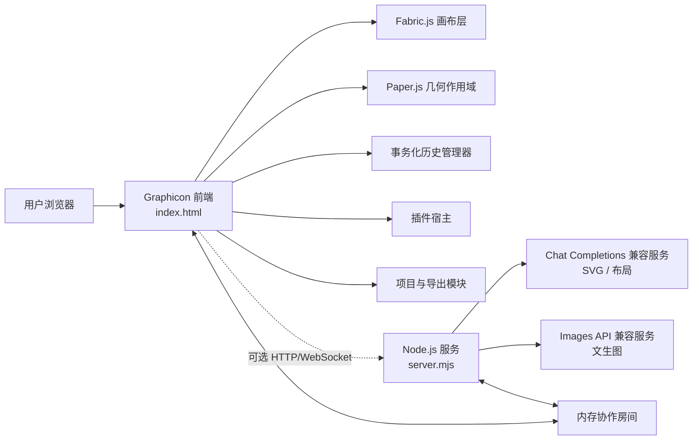
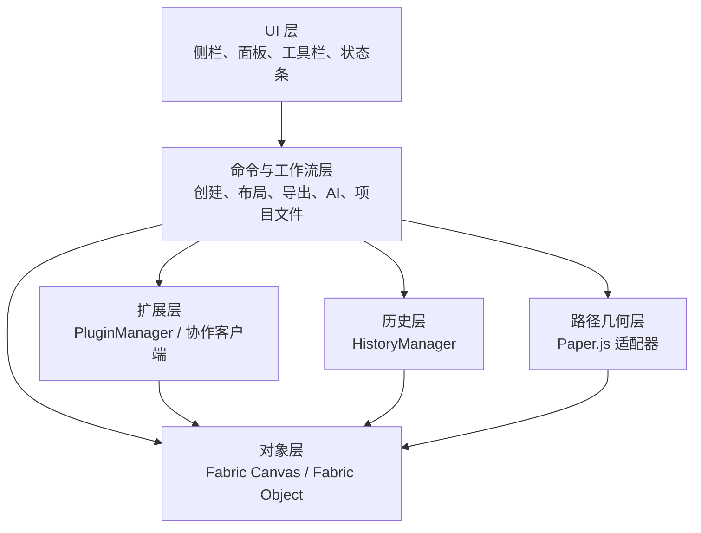
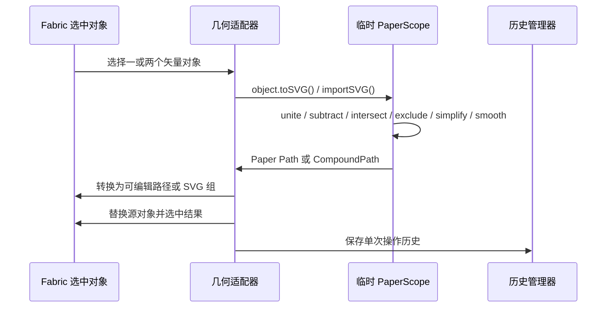
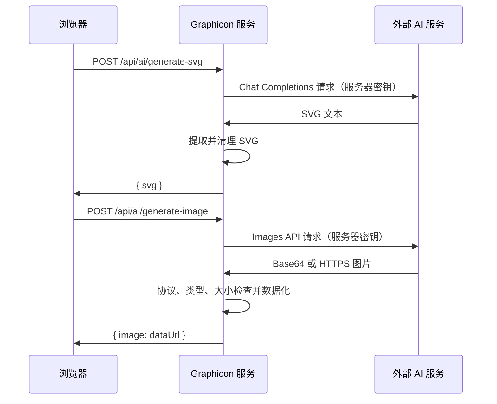

# Graphicon 架构设计文档

> **文档目标：** 说明 Graphicon 当前实现的模块边界、核心数据流、扩展方式、运维约束和演进建议。本文面向维护者、插件开发者、部署人员与后续功能实现者。

## 1. 架构概览

Graphicon 是一个以单页浏览器编辑器为核心、以轻量 Node.js 服务为可选能力层的图形编辑系统。浏览器负责绝大多数编辑、图层、布局、导出和路径交互；服务端仅负责静态文件托管、AI 密钥隔离、AI 请求代理，以及基于 WebSocket 的临时协作房间。

这种设计把高频交互保留在本地浏览器，降低编辑延迟，并避免在服务端持久化用户设计数据。AI 与协作需要服务端运行，但编辑器在直接打开 `index.html` 时仍能提供基础离线功能。



| 架构原则 | 当前实现方式 | 直接收益 |
| --- | --- | --- |
| 浏览器优先 | 编辑与导出均在浏览器执行 | 本地操作响应快，基础功能不依赖后端。 |
| 计算分层 | Fabric.js 管理画布；Paper.js 专注路径几何 | 减少引擎职责重叠，保留现有对象系统。 |
| 密钥不下发 | AI 密钥只从 `server.mjs` 读取环境变量 | 浏览器、项目文件和 Git 仓库不持有 API 密钥。 |
| 显式高成本操作 | 布尔运算、AI 调用由用户点击触发 | 避免拖动时触发高代价计算。 |
| 可退化运行 | AI 缺失时可使用本地快速排列；服务缺失时可编辑 | 降低外部依赖造成的功能中断。 |

## 2. 仓库结构与职责

| 路径 | 职责 | 维护注意事项 |
| --- | --- | --- |
| `index.html` | 单文件前端：结构、样式、编辑器逻辑、插件宿主、协作客户端与导出。 | 文件集中但体积较大；修改时必须运行静态检查与浏览器测试。 |
| `server.mjs` | 静态托管、AI SVG/图像/布局代理、WebSocket 协作房间。 | 不要把密钥、业务状态或未经限制的远程请求暴露到浏览器。 |
| `plugins/example-badge-plugin.js` | 受控插件 API 的最小示例。 | 第三方脚本拥有页面执行权限，只应加载可信来源。 |
| `tests/editor.e2e.spec.mjs` | Playwright 端到端回归测试。 | 新增关键交互时应同步加入稳定的真实浏览器测试。 |
| `playwright.config.mjs` | Chromium 测试配置与隔离服务定义。 | 应保持端到端测试独立启动服务的能力。 |
| `.env.example` | 服务端环境变量样例。 | 仅保留占位符，严禁出现真实密钥。 |
| `README.md` | 快速开始与功能总览。 | 与本文档、用户手册保持一致。 |
| `docs/USER_GUIDE_zh-CN.md` | 终端用户操作手册。 | 功能 UI 或快捷键变化后必须更新。 |

项目使用 Node.js 18+。运行时生产依赖仅包含 `ws`；测试使用 Playwright。客户端依赖通过固定版本的公共脚本引用加载，包括 Fabric.js 5.3.1 和 Paper.js 0.12.18。

## 3. 前端分层设计

虽然前端位于单个 HTML 文件，逻辑上可分为六层。后续重构为 ES Modules 或 TypeScript 时，应以这些边界拆分。



### 3.1 UI 层

UI 层将按钮、输入控件和面板绑定到命令函数。例如，工具栏按钮调用撤销、重做、钢笔、节点编辑或导出；右侧面板调用对齐、分布、路径几何和智能排版。UI 不应直接持久化数据，而应调用命令层，并通过 `updateCanvasUI()`、`historyManager.updateUI()` 等统一刷新入口同步状态。

新增 UI 时应遵循以下约束：所有可点击元素必须具有明确的 `title` 或可访问名称；异步操作应禁用触发按钮；错误应通过状态文本与 `showToast()` 同时反馈；不应依赖不可见的临时 DOM 状态作为唯一事实来源。

### 3.2 对象层：Fabric.js

Fabric.js 是画布对象、选择控制、渲染、图片与 SVG 导入、序列化和 SVG 导出的主引擎。应用把用户对象定义为既非网格、也非 `excludeFromExport` 的对象。用户对象会获得稳定的 `id`、可读 `name`，并可保存 `locked`、`editablePathData` 和 `filterId` 等扩展属性。

> Fabric.js 的 `Path` 构造函数接收 SVG 路径数据，且对象可以序列化与导出 SVG，因此适合作为 Graphicon 的交互和持久化对象层。[1]

对象生命周期如下：

1. 创建、导入、插件或 AI 功能生成对象。
2. `prepareUserObject()` 赋予 ID、名称和锁定状态。
3. 对象加入 `canvas`，对象事件刷新 UI、协作同步并登记历史。
4. 图层面板和属性面板通过 Fabric 选择状态呈现对象。
5. 项目保存、历史快照、协作快照与导出基于允许序列化的属性生成数据。

### 3.3 路径几何层：Paper.js 适配器

Paper.js 不替代 Fabric.js。它在临时 `PaperScope` 中执行矢量几何计算，完成后将结果导回 Fabric 对象。该策略避免为几何运算重新实现选择、图层、导出和协作。



对于单一 Paper `Path`，适配器会把 `segments`、`handleIn` 和 `handleOut` 转换为 `editablePathData.nodes`，从而保留节点编辑能力。对于复合路径（例如含孔洞的相减或排除结果），系统会导入 SVG 并建立 Fabric 组；这类结果仍可导出和参与图层操作，但不保证拥有单一路径的节点编辑数据。

Paper.js 原生提供路径布尔运算、相交检测与路径简化等能力，因此适合作为专门的计算层。[2]

### 3.4 命令与工作流层

命令层包括：对象创建与复制、尺寸与位置更新、对齐/分布、画布尺寸、路径编辑、几何运算、项目导入导出、AI 生成和智能排版。关键原则是把一次用户意图封装为一次可追溯操作，避免 UI 代码散落地修改 Fabric 对象。

`applyLayoutPlan()` 是典型的批量命令：它先选择目标对象，规范化布局计划，再在 `historyManager.transaction()` 中更新对象位置和必要的缩放，最后刷新画布和 UI。未来新增批量变换、模板应用或批量滤镜时，应复用相同模式。

### 3.5 事务化历史层

`HistoryManager` 维护 `undoStack`、`redoStack` 和当前状态，默认上限为 120 步。与旧式“仅画布对象 JSON”不同，快照还包括画布宽高、背景和网格开关。

```json
{
  "version": 4,
  "canvas": { "width": 800, "height": 800, "backgroundColor": null },
  "grid": false,
  "objects": []
}
```

| 方法 | 作用 | 使用时机 |
| --- | --- | --- |
| `capture()` | 生成可比较、可恢复的画布文档字符串 | 内部调用；不应在高频拖动中手动循环调用。 |
| `save(label)` | 检测状态变化、压入撤销栈并清空重做栈 | 单对象编辑、导入、路径几何等离散命令。 |
| `begin(label)` / `end(label)` | 聚合一组变化为一条历史记录 | 布局、批量对象操作或复杂插件命令。 |
| `transaction(label, callback)` | 对批量命令提供安全包装 | 推荐的新功能入口。 |
| `undo()` / `redo()` | 异步加载历史快照 | 按钮或键盘快捷键调用。 |
| `reset(label)` | 建立新的历史基线 | 新建、项目导入或远端协作快照应用后。 |

恢复过程中 `locked` 会阻止 Fabric 的 `object:added`、`object:removed` 等事件反向写入历史。任何新增命令若直接修改多个对象，应确认其不在恢复锁期间调用 `save()`，并优先使用事务包装。

### 3.6 插件扩展层

插件通过 `window.Graphicon.registerPlugin(plugin)` 注册。插件宿主会检查 ID、重复注册和 `setup(api)` 入口，并向插件提供受控 API。

```js
window.Graphicon.registerPlugin({
  id: 'vendor.shape-tool',
  name: 'Shape Tool',
  version: '1.0.0',
  setup(api) {
    api.registerTool({
      id: 'add-shape',
      label: '自定义图形',
      run({ fabric }) {
        const shape = new fabric.Circle({ radius: 40, fill: '#0d99ff' });
        api.addObject(shape, '自定义图形');
      },
    });
  },
});
```

| API | 用途 | 约束 |
| --- | --- | --- |
| `registerTool(action)` | 注册创建或编辑命令 | 必须提供唯一 ID 和 `run()`。 |
| `registerFilter(action)` | 注册依赖当前选择的滤镜命令 | 运行前宿主检查是否存在选中对象。 |
| `addObject(object, name)` | 标准化新增对象 | 自动准备对象、加入画布、保存历史并刷新 UI。 |
| `getActiveObject()` / `getSelectedObjects()` | 读取选择状态 | 插件不应自行维护选择副本。 |
| `requestRender()` / `saveHistory()` | 请求刷新或显式保存 | 多步操作应考虑宿主历史的事务边界。 |

插件并非安全沙箱。其 JavaScript 与页面具有同等权限，因此当前架构只支持在 HTML 中预先引用已审查的可信插件。若未来要支持用户上传插件，应改为隔离 iframe、权限清单和消息协议，而不能直接执行任意脚本。

## 4. 服务端设计

### 4.1 HTTP 服务与安全基线

`server.mjs` 使用 Node.js 原生 HTTP 服务静态托管项目文件，使用 `ws` 提供 WebSocket 协作。所有 API 响应设置 `Cache-Control: no-store` 与 `X-Content-Type-Options: nosniff`。静态文件路径会被规范化，并拒绝超出项目根目录的访问。

服务端仅接受受限制大小的 JSON 请求。AI 提示词受 `MAX_PROMPT_LENGTH` 约束；协作消息和房间画布文档受 `MAX_DOCUMENT_SIZE` 约束；远端图片限制 HTTPS、图片 MIME 类型和最大字节数。

### 4.2 AI API 边界



| 路由 | 输入 | 输出 | 安全与失败行为 |
| --- | --- | --- | --- |
| `POST /api/ai/generate-svg` | `prompt` | 安全 SVG | 清除脚本与事件属性；没有 `AI_API_KEY` 时返回 `503`。 |
| `POST /api/ai/generate-image` | `prompt`、`size` | Base64 数据 URL | 使用 `AI_IMAGE_API_KEY` 或回退到 `AI_API_KEY`；校验图像协议、MIME 与大小。 |
| `POST /api/ai/layout` | 画布尺寸与对象摘要 | 受限布局计划 | 仅返回模式、列数、间距、留白和简短说明；没有文本模型密钥时返回 `503`。 |
| `GET /` 与静态路径 | 请求路径 | 前端资源 | 路径规范化，拒绝目录逃逸。 |

AI SVG 使用兼容 Chat Completions 的模型，要求返回单一 `<svg>` 文档。AI 排版也使用 Chat Completions，但服务端将结果解析为 JSON 并对数值范围进行钳制。图像生成使用兼容 `POST /images/generations` 的提供商；因不同提供商的模型和响应字段不同，部署前必须以实际提供商文档验证。

> 该服务不是通用代理。不得新增“前端传入任意 URL、任意请求头、任意模型路径”的接口，否则会产生密钥泄漏、SSRF 或成本失控风险。

### 4.3 环境变量

| 变量 | 用途 | 是否必需 |
| --- | --- | --- |
| `PORT` | HTTP 与 WebSocket 服务端口 | 否，默认 `4173`。 |
| `AI_API_KEY` | SVG 生成和 AI 排版的服务端密钥 | 对 SVG/AI 排版必需。 |
| `AI_API_BASE` | Chat Completions 基础地址 | 否，默认 OpenAI 兼容地址。 |
| `AI_MODEL` | SVG/布局模型 | 否，默认 `gpt-4.1-mini`。 |
| `AI_IMAGE_API_KEY` | 图像服务独立密钥 | 否，缺失时回退到 `AI_API_KEY`。 |
| `AI_IMAGE_BASE` | Images API 基础地址 | 否，缺失时回退到 `AI_API_BASE`。 |
| `AI_IMAGE_MODEL` | 文生图模型 | 否，默认 `gpt-image-1`。 |

所有密钥只能写入部署环境或本地未提交的 `.env` 文件。`.env.example` 仅用于展示变量形状。

## 5. 实时协作设计

### 5.1 协作协议

协作客户端通过 `ws(s)://<host>/collaboration` 建立连接。用户加入前提供 `roomId` 与显示名称。服务端维护 `Map<roomId, room>`；每个房间保存连接集合、当前序号和最近完整画布文档。

| 消息类型 | 方向 | 作用 |
| --- | --- | --- |
| `join` | 客户端 → 服务端 | 加入房间；服务端返回已有文档、成员和版本号。 |
| `joined` | 服务端 → 客户端 | 确认加入并提供初始状态。 |
| `sync` | 客户端 → 服务端 | 上传当前完整画布文档。 |
| `snapshot` | 服务端 → 其他客户端 | 广播最新完整画布文档。 |
| `presence` | 服务端 → 房间 | 广播成员与版本变化。 |
| `cursor` | 双向 | 为未来远端光标预留的即时消息。 |
| `leave` | 客户端 → 服务端 | 主动离开房间。 |

客户端对对象增删改使用约 140ms 防抖发送完整快照。收到远端 `snapshot` 时会设置 `applyingRemote`，暂停本地回传、重载画布并调用 `historyManager.reset()`，将远端状态建立为本地新的操作基线。

### 5.2 当前限制与生产演进

当前实现是**单实例内存房间 + 最后写入完整快照**模型。它适合小团队共创、演示和局域网使用，但并不提供冲突合并、用户认证、权限、持久化或跨实例共享。

生产升级应按以下顺序推进：

1. 在连接握手中接入身份认证与项目授权。
2. 用数据库或对象存储保存项目版本、缩略图和审计日志。
3. 用 Redis 等共享状态取代进程内 `Map`，支持多实例扩展。
4. 从完整快照协议升级为对象级操作或 CRDT/OT 协议，以处理并发冲突。
5. 增加房间速率限制、对象数量限制、可观测性和异常恢复。

## 6. 数据模型与序列化

系统存在三类主要文档，不应混淆。

| 文档 | 产生位置 | 主要用途 | 是否持久化 |
| --- | --- | --- | --- |
| Fabric JSON | `canvas.toJSON(saveProps)` | 内部对象序列化、部分历史操作。 | 仅作为更高层文档的对象载荷。 |
| Graphicon 项目文档 | 保存/打开项目功能 | 用户继续编辑的 `.graphicon` 文件。 | 由浏览器下载、用户自行存储。 |
| 历史快照 | `HistoryManager.capture()` | 本地撤销/重做。 | 仅内存，最大 120 步。 |
| 协作文档 | `collaborationDocument()` | 房间内最新完整画布状态。 | 当前仅服务进程内存。 |

所有文档中都应排除网格、辅助线、路径节点控制柄和其他 `excludeFromExport` 对象。扩展对象属性时，必须同时评估：`saveProps`、项目保存、历史快照、协作文档和 SVG 导出的兼容性。

## 7. 性能与可靠性策略

| 场景 | 当前策略 | 后续优化方向 |
| --- | --- | --- |
| 节点拖动 | `requestAnimationFrame` 合并路径刷新与控制柄重绘。 | 使用更细粒度控制柄更新，减少全画布重绘。 |
| 布尔路径 | 用户显式触发，使用临时 PaperScope。 | 对高节点图形使用 Worker；增加计算进度与取消机制。 |
| 历史记录 | 快照去重、120 步上限、批量事务。 | 大型项目可改为命令差分或压缩快照。 |
| 协作同步 | 140ms 防抖、完整快照。 | 对象级补丁、二进制编码、版本冲突处理。 |
| 图片导出 | 浏览器端边界裁切与倍率导出。 | 超大画布可采用 Worker 或服务端渲染。 |
| AI 图像 | 服务端限制提示词、响应类型和图片大小。 | 增加每用户配额、超时、审计日志和内容策略。 |

## 8. 测试与质量门禁

`pnpm test` 会顺序运行静态契约检查与 Playwright 端到端测试。当前端到端测试覆盖插件、可编辑路径与贝塞尔节点、事务历史与网格恢复、本地智能排版回滚、Paper.js 布尔运算、SVG/PNG/JPG/WebP 导出，以及双客户端协作。

```bash
pnpm run check
pnpm run test:e2e
pnpm test
```

新增功能的最小验收标准如下：

| 改动类型 | 必需验证 |
| --- | --- |
| 新增 UI 控件 | 可见、可操作、键盘可达，并在静态检查中存在关键入口。 |
| 新增对象属性 | 项目保存、历史、协作和导出不会丢失或泄漏该属性。 |
| 新增批量命令 | 被封装为一次历史事务，并有撤销/重做测试。 |
| 新增 AI 路由 | 无密钥时安全失败；输入、输出、大小和错误消息均受限制。 |
| 新增协作消息 | 房间隔离、最大负载、远端应用防回传以及至少两个客户端测试。 |
| 新增插件 API | 参数校验、重复注册、示例代码与可信来源边界。 |

## 9. 部署建议

Graphicon 当前服务可部署到任何支持 Node.js 18+、持久 WebSocket 连接和私有环境变量的运行环境。部署时应通过平台密钥管理界面注入变量，而不是把 `.env` 放入公开仓库或前端构建产物。

对于单个团队，保持单一常驻实例即可维持当前内存协作房间。若使用会在请求结束后休眠的无状态环境，实时协作和房间状态将不稳定；应选择允许长连接的持续运行模式，或按 [实时协作设计](#5-实时协作设计) 的演进路径改为共享状态。

建议在反向代理或托管平台层设置 HTTPS、请求体大小限制、WebSocket 超时策略和基础访问日志。AI 相关端点还应按用户、IP 或项目限制频率和并发数，以控制成本。

## 10. 后续演进建议

| 优先级 | 建议 | 价值 |
| --- | --- | --- |
| 高 | 把 `index.html` 拆分为 ES Modules，并为状态、画布、历史、AI 和协作建立独立模块。 | 提高可维护性与单元测试能力。 |
| 高 | 为协作添加身份认证、项目持久化和对象级变更协议。 | 使多人编辑可用于生产团队。 |
| 高 | 为 AI 端点增加鉴权、配额、速率限制和审计。 | 控制成本并增强安全性。 |
| 中 | 用 Worker 执行复杂 Paper.js 几何计算。 | 降低大路径操作造成的主线程卡顿。 |
| 中 | 增加命令式或差分历史。 | 改善大型项目的内存占用。 |
| 中 | 引入插件权限清单和隔离运行环境。 | 支持更安全的第三方扩展生态。 |
| 低 | 增加缩略图、模板、导出预设和版本比较。 | 改善创作工作流与交付效率。 |

## 参考资料

[1] [Fabric.js Path API](https://fabricjs.com/api/classes/path/)

[2] [Paper.js Boolean Operations](https://paperjs.org/examples/boolean-operations/)

[3] [Paper.js Path Simplification](https://paperjs.org/examples/path-simplification/)

[4] [Node.js HTTP API](https://nodejs.org/api/http.html)

[5] [`ws` WebSocket library](https://github.com/websockets/ws)
