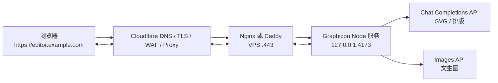

# Graphicon Cloudflare 部署指南

> **适用范围：** 本文档适用于当前 Graphicon 架构：浏览器编辑器位于 `index.html`，而 AI 代理和实时协作位于长期运行的 Node.js 服务 `server.mjs`。

Cloudflare 为 Graphicon 提供两条不同的部署路径。选择前必须先明确是否需要 AI 和实时协作，因为当前前端会把 `/api/ai/*` 和 `/collaboration` 请求发送至**与页面相同的源站**。

| 部署路径 | 是否需要 VPS | 可用能力 | 推荐场景 |
| --- | --- | --- | --- |
| Cloudflare Pages 静态模式 | 否 | 本地画布、图层、路径、Paper.js 布尔运算、本地智能排版、项目文件、PNG/JPG/WebP/SVG 导出。 | 作品演示、单人离线式编辑、公开预览。 |
| Cloudflare 代理 + VPS 全功能模式 | 是 | 包含静态模式全部能力，以及 AI SVG、文生图、AI 排版和实时协作。 | 真实团队使用、需要自定义域名与生产服务。 |
| Workers + Durable Objects 重构模式 | 当前不可直接使用 | 理论上可提供全边缘 AI/协作。 | 后续架构演进，不是当前仓库的直接部署选项。 |

> **关键结论：** 不要将当前仓库直接作为 Pages Functions 或 Workers 应用部署并期待 `server.mjs` 自动运行。它使用 Node 原生 HTTP、`ws` 和进程内房间状态，需要重构为 Workers API 与 Durable Objects 后才能采用该模型。[1] [2]

## 一、部署前检查

部署前在本地执行以下命令，确保当前提交可用：

```bash
pnpm install --frozen-lockfile
pnpm test
```

同时确认以下安全边界：

| 项目 | 要求 |
| --- | --- |
| `.env` | 仅保存在服务器或平台密钥管理中；不可提交到 Git。 |
| `AI_API_KEY` / `AI_IMAGE_API_KEY` | 只在全功能 Node 服务的环境中配置。 |
| GitHub 仓库 | Pages 模式与 VPS 模式均可从 `main` 分支发布。 |
| 域名 | 静态 Pages 可使用 Pages 自定义域名；全功能模式应将应用子域名代理到 VPS。 |
| WebSocket | 全功能模式中，在 Cloudflare Network 设置确认 **WebSockets** 已开启。 |

## 二、Cloudflare Pages：静态编辑器模式

### 2.1 能力和限制

Cloudflare Pages 可以直接托管没有构建步骤的静态 HTML。Graphicon 的 `index.html` 位于仓库根目录，因此可直接把仓库根目录作为输出目录。官方静态 HTML 指南明确支持这种无框架部署方式，并建议无构建场景使用 `exit 0`。[1]

| 功能 | Pages 静态模式中的状态 | 原因 |
| --- | --- | --- |
| 编辑、图层、路径、布尔运算、导出 | 可用 | 均在浏览器执行。 |
| `.graphicon` 保存/打开 | 可用 | 文件在浏览器中下载/读取。 |
| 本地快速智能排版 | 可用 | 不依赖 AI 服务。 |
| AI SVG、文生图、AI 排版建议 | 不可用 | 当前需要同源 Node 的 `/api/ai/*` 路由。 |
| 实时协作 | 不可用 | 当前需要同源 Node 的 `/collaboration` WebSocket。 |
| Pages Functions 直接运行 `server.mjs` | 不可用 | 运行时与当前 Node/`ws`/内存状态模型不兼容。 |

### 2.2 通过 GitHub 导入 Pages

1. 登录 Cloudflare Dashboard，进入 **Workers & Pages**。
2. 选择 **Create application**，然后选择 **Pages**。
3. 选择 **Import an existing Git repository**，授权并选择 `sincalwow/Graphicon`。
4. 将生产分支设为 `main`。
5. 使用下列配置：

| 配置项 | 值 |
| --- | --- |
| Framework preset | `None` 或静态 HTML。 |
| Build command | `exit 0`。 |
| Build output directory | `.`。 |
| Root directory | 留空，使用仓库根目录。 |
| Node version | 无静态构建要求；若页面提示，可选择 Node 18 或更高。 |

6. 点击 **Save and Deploy**。首次部署完成后，Cloudflare 会提供 `https://<项目名>.pages.dev` 地址。
7. 在部署详情页验证顶层 `index.html` 被正确返回。若看到 `404`，检查输出目录仍是包含 `index.html` 的根目录。[1]

### 2.3 自定义域名

在 Pages 项目内，进入 **Custom domains**，选择 **Set up a domain**，填写需要绑定的域名或子域名。必须从 Pages 的自定义域名流程中关联，不能只在 DNS 页面手动新增 CNAME；官方文档指出，未经项目关联流程的手动 CNAME 可能导致域名无法正确解析。[3]

| 域名形式 | 所需条件 |
| --- | --- |
| 根域名，例如 `example.com` | 域名须作为 Cloudflare Zone 管理，并把权威 DNS 指向 Cloudflare。 |
| 子域名，例如 `editor.example.com` | 可通过自定义 CNAME 指向 `<项目名>.pages.dev`；若 Zone 已在 Cloudflare，同意关联后可自动创建。 |

建议将静态演示部署在 `demo.example.com` 或 `editor-static.example.com`，避免与后续全功能 VPS 应用域名混用。

### 2.4 静态模式验收

发布后应手动验证：

```bash
curl -I https://<项目名>.pages.dev/
```

浏览器中应依次检查：添加素材、修改图层、绘制路径、执行路径合并、使用“快速排列”、下载 PNG 与保存 `.graphicon`。AI 和协作面板出现“需要通过服务运行”或“未配置”提示属于预期行为，不是部署错误。

## 三、Cloudflare 代理 + VPS：当前代码的全功能模式

### 3.1 推荐拓扑

当前代码要启用 AI 与协作，推荐将整个应用域名代理至 VPS，而非把前端放在 Pages、后端放在另一个域名。原因是浏览器客户端对 AI 使用相对路径 `/api/ai/*`，对 WebSocket 使用 `window.location.host` 计算出的同源地址。



Cloudflare 的代理记录会使 HTTP/HTTPS 流量经过其网络，提供边缘 TLS、规则和基础保护；DNS-only 会暴露 VPS 的实际 IP，且无法获得 Cloudflare 的 HTTP/HTTPS 代理能力。[4]

### 3.2 DNS 与 SSL/TLS 配置

1. 在 Cloudflare Zone 的 **DNS > Records** 中，为应用创建记录：

| 类型 | 名称 | 内容 | Proxy status |
| --- | --- | --- | --- |
| `A` | `editor` | VPS 公网 IPv4 地址 | **Proxied**（橙色云）。 |
| `AAAA` | `editor` | 可选的 VPS IPv6 地址 | **Proxied**（仅在 IPv6 已配置时）。 |

2. 在 **SSL/TLS** 中，推荐使用 **Full (strict)**。
3. 在 VPS 上配置有效的源站证书。可以使用 Let's Encrypt，也可以在 Cloudflare 创建 Origin Certificate 并仅安装在 VPS 的反向代理上。
4. 在 **Network** 中确认 **WebSockets** 已启用。Cloudflare 支持将代理的 WebSocket 连接转发到源站；官方也建议为长期连接实现心跳和重连，因为边缘网络发布可能中断现有连接。[5]

### 3.3 Cloudflare 规则建议

| 规则类型 | 建议 | 原因 |
| --- | --- | --- |
| Cache Rules | 对 `/api/*` 使用 **Bypass cache**。 | AI 请求包含动态结果与错误状态，不能缓存。 |
| Cache Rules | 对 `/collaboration*` 使用 **Bypass cache**。 | WebSocket 升级和实时状态不应被缓存。 |
| WAF / Rate Limiting | 对 `POST /api/ai/*` 施加按 IP 或用户的限速。 | 控制 AI 成本并降低滥用风险。 |
| WAF | 检查 WebSocket 初始升级请求规则不会误拦截已知客户端。 | WebSocket 的初始 HTTP 101 请求会经过 WAF 规则。[5] |
| Security | 仅开放 VPS 的 `80/443`，应用端口 `4173` 仅监听回环。 | 防止 Node 服务端口直接暴露。 |

Cloudflare 会在网络维护或发布时可能终止 WebSocket。当前客户端可在连接失败后由用户重新加入房间，但尚未实现自动重连与心跳。对于关键协作会话，应把“保存项目文件”作为阶段性检查点。

### 3.4 为什么不建议“Pages 前端 + VPS 后端”直接拆分

虽然可在架构上把静态页面放到 Pages、把 Node 服务放到 `api.example.com`，但**当前仓库不支持直接这样部署**：前端没有配置独立 API 基础地址或独立 WebSocket URL。直接拆分会使 `/api/ai/*` 指向 Pages 域名并返回 404，协作 WebSocket 也会尝试连接 Pages 域名。

若未来需要采用该结构，应新增例如 `window.GRAPHICON_API_BASE` 与 `window.GRAPHICON_WS_BASE` 配置，并在服务端实现严格 CORS、Origin 检查、Cookie/Token 认证和跨域 WebSocket 授权。完成这些改造前，请使用“Cloudflare 代理 + VPS”全功能方案。

## 四、Cloudflare Workers 与 Durable Objects：未来演进说明

Cloudflare Workers 可以处理 WebSocket，官方资料建议需要协调多个连接时使用 Durable Objects 作为单点协调组件。[2] 这与 Graphicon 的协作房间需求相符，但当前实现依赖 Node HTTP、`ws` 和内存 `Map`，不能简单复制到 Worker。

迁移为 Workers/Durable Objects 至少需要完成以下工程：

1. 将 `server.mjs` 的 HTTP 路由改写为 Worker `fetch()` 处理器。
2. 使用 Secrets 替代服务器环境变量，并重写 AI `fetch` 与错误包装逻辑。
3. 用 Durable Object 承载每个房间的成员、快照、版本和 WebSocket 会话。
4. 重新实现静态资源服务或由 Pages 处理静态资产。
5. 重写协作自动化测试，覆盖 Worker/Durable Object 部署环境。

此路线可以降低 VPS 运维成本，但属于功能迁移，而不是当前版本的零配置部署。

## 五、部署后的验证清单

| 检查 | 静态 Pages | Cloudflare + VPS |
| --- | --- | --- |
| `https://域名/` 返回编辑器 | 必须 | 必须 |
| 添加、图层、路径、导出 | 必须 | 必须 |
| 项目保存与恢复 | 必须 | 必须 |
| `/api/ai/generate-svg` 未配置密钥时返回安全错误 | 不适用 | 必须 |
| AI SVG/文生图/AI 排版 | 不适用 | 配置密钥后验证 |
| 加入同一协作房间的两浏览器同步 | 不适用 | 必须 |
| `wss://域名/collaboration` 成功升级 | 不适用 | 必须 |
| 关闭或重启 Node 服务后页面合理失败 | 不适用 | 必须 |

在全功能模式中，可使用浏览器开发者工具的 Network 面板确认 `/collaboration` 状态为 WebSocket。也可使用一个最小 WebSocket 客户端对单个 URL 排查连接问题；Cloudflare 官方将此作为定位 WebSocket 问题的实用方法。[5]

## 参考资料

[1] [Cloudflare Pages：部署静态 HTML](https://developers.cloudflare.com/pages/framework-guides/deploy-anything/)

[2] [Cloudflare Workers：WebSockets 与 Durable Objects 建议](https://developers.cloudflare.com/workers/runtime-apis/websockets/)

[3] [Cloudflare Pages：自定义域名](https://developers.cloudflare.com/pages/configuration/custom-domains/)

[4] [Cloudflare DNS：代理状态](https://developers.cloudflare.com/dns/proxy-status/)

[5] [Cloudflare Network：WebSockets 代理](https://developers.cloudflare.com/network/websockets/)
