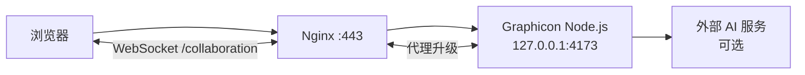

# Graphicon VPS 生产部署指南

> **目标：** 在一台长期运行的 Linux VPS 上部署当前 Graphicon 全功能服务，提供编辑器、AI SVG、文生图、AI 排版和 WebSocket 实时协作。本文以 Ubuntu 24.04、Nginx、systemd 和 Node.js 18+ 为例。

Graphicon 的 `server.mjs` 同时提供静态页面、AI 代理和基于内存的协作房间。因此它需要作为一个**常驻单实例 Node 服务**运行。对于当前版本，VPS 是最直接的全功能生产部署选择。

## 一、部署拓扑与前置条件



| 前置条件 | 最低要求 | 说明 |
| --- | --- | --- |
| 操作系统 | Ubuntu 22.04/24.04 或等价 Linux | 本文命令以 Ubuntu 为例。 |
| 规格 | 1 vCPU、1 GB RAM 起步 | 小团队编辑器与轻量协作的起点；高倍率导出或大量连接需要更高规格。 |
| Node.js | 18 或更高 | `package.json` 规定 `node >=18`。 |
| 域名 | 推荐 | 便于 HTTPS、WebSocket 和 AI 同源访问。 |
| 公网端口 | `80`、`443` | Node 的 `4173` 仅监听本机回环，不应直接暴露。 |
| 代码来源 | GitHub 仓库访问权限 | 本文使用公开 HTTPS clone；私有仓库应使用部署密钥或受限令牌。 |

如果同时使用 Cloudflare，请先阅读 [Cloudflare 部署指南](CLOUDFLARE_DEPLOYMENT_zh-CN.md)。Cloudflare 代理 + 本 VPS 是当前代码的推荐全功能组合。

## 二、初始化 VPS

### 2.1 更新系统与创建受限运行用户

以具有 `sudo` 权限的账号登录 VPS，执行：

```bash
sudo apt update
sudo apt upgrade -y
sudo apt install -y git nginx curl ca-certificates ufw
sudo adduser --system --group --home /opt/graphicon graphicon
sudo install -d -o graphicon -g graphicon -m 0755 /opt/graphicon
sudo install -d -o root -g graphicon -m 0750 /etc/graphicon
```

不要用 `root` 运行 Graphicon。单独的系统用户可缩小 Node 服务被利用时的权限范围。

### 2.2 安装 Node.js 与 pnpm

安装方式应以目标系统可提供的 Node 18+ 版本为准。安装完成后必须验证版本：

```bash
node --version
npm --version
```

如果版本低于 18，请使用组织认可的 Node 发行渠道升级。随后启用 Corepack 并准备 pnpm：

```bash
sudo corepack enable
sudo corepack prepare pnpm@latest --activate
pnpm --version
```

> **说明：** 不建议在生产服务器上使用未经审查的“一键 curl 安装脚本”。请优先使用操作系统包源、受信任的 Node 发行渠道或企业镜像。

### 2.3 部署应用代码

以下示例将公开仓库克隆至 `/opt/graphicon/app`：

```bash
sudo -u graphicon git clone https://github.com/sincalwow/Graphicon.git /opt/graphicon/app
cd /opt/graphicon/app
sudo -u graphicon pnpm install --frozen-lockfile --prod
```

`--prod` 会安装运行时所需的 `ws`，不会在生产机安装 Playwright 浏览器测试依赖。应在 CI 或部署前机器执行完整 `pnpm test`，不要把浏览器测试作为每次生产启动的阻塞步骤。

## 三、配置环境变量与 AI 服务

### 3.1 创建受保护的环境文件

Graphicon 通过 systemd 从 `/etc/graphicon/graphicon.env` 注入环境变量。复制并编辑以下模板，替换占位符；不要把真实值写进 Git 或仓库内 `.env`。

```bash
sudo tee /etc/graphicon/graphicon.env > /dev/null <<'EOF'
NODE_ENV=production
PORT=4173

# SVG 生成与 AI 排版：兼容 Chat Completions 的服务
AI_API_KEY=replace_with_chat_provider_key
AI_API_BASE=https://api.openai.com/v1
AI_MODEL=gpt-4.1-mini

# 可选：文生图。留空的 AI_IMAGE_API_KEY 会回退到 AI_API_KEY。
AI_IMAGE_API_KEY=
AI_IMAGE_BASE=https://api.openai.com/v1
AI_IMAGE_MODEL=gpt-image-1
EOF
sudo chown root:graphicon /etc/graphicon/graphicon.env
sudo chmod 0640 /etc/graphicon/graphicon.env
```

| 功能 | 必需变量 | 未设置时的行为 |
| --- | --- | --- |
| 基础编辑、导出、项目文件、协作 | 无 | 仍可运行。 |
| AI SVG | `AI_API_KEY` | `/api/ai/generate-svg` 返回安全的 `503` 错误。 |
| AI 排版建议 | `AI_API_KEY` | 前端提示改用本地“快速排列”。 |
| 文生图 | `AI_IMAGE_API_KEY` 或 `AI_API_KEY` | `/api/ai/generate-image` 返回安全的 `503` 错误。 |

> **密钥轮换：** 修改环境文件后执行 `sudo systemctl restart graphicon`。不要把密钥写入 Nginx 配置、前端 JavaScript、Shell 历史或终端截图。

### 3.2 先进行本机启动验证

在创建 systemd 服务前，可用运行用户进行一次受控验证：

```bash
cd /opt/graphicon/app
sudo -u graphicon env $(sudo cat /etc/graphicon/graphicon.env | grep -v '^#' | xargs) node server.mjs
```

另开一个终端检查：

```bash
curl -I http://127.0.0.1:4173/
curl -sS -X POST http://127.0.0.1:4173/api/ai/layout \
  -H 'Content-Type: application/json' \
  --data '{"canvas":{"width":800,"height":800},"objects":[{"id":"a","name":"标题","type":"text","width":200,"height":80},{"id":"b","name":"图形","type":"rect","width":150,"height":150}]}'
```

按 `Ctrl+C` 结束前台进程。若没有配置 `AI_API_KEY`，第二个请求返回“未配置 AI_API_KEY”的 JSON 错误是正确结果。

## 四、使用 systemd 守护 Node 服务

创建 `/etc/systemd/system/graphicon.service`：

```ini
[Unit]
Description=Graphicon vector editor service
After=network-online.target
Wants=network-online.target

[Service]
Type=simple
User=graphicon
Group=graphicon
WorkingDirectory=/opt/graphicon/app
EnvironmentFile=/etc/graphicon/graphicon.env
ExecStart=/usr/bin/node /opt/graphicon/app/server.mjs
Restart=on-failure
RestartSec=5
TimeoutStopSec=20
NoNewPrivileges=true
PrivateTmp=true

[Install]
WantedBy=multi-user.target
```

确认 Node 实际路径后再写入 `ExecStart`：

```bash
command -v node
sudo systemctl daemon-reload
sudo systemctl enable --now graphicon
sudo systemctl status graphicon --no-pager
```

常用运行命令如下：

| 命令 | 用途 |
| --- | --- |
| `sudo systemctl status graphicon` | 查看服务是否运行。 |
| `sudo journalctl -u graphicon -f` | 实时查看服务日志。 |
| `sudo systemctl restart graphicon` | 修改代码或环境变量后重启。 |
| `sudo systemctl stop graphicon` | 维护时停止服务。 |
| `sudo systemctl enable graphicon` | 确保服务器重启后自动恢复。 |

systemd 的 `Restart=on-failure` 会在 Node 进程异常退出时重启服务；长期运行的 WebSocket 服务应使用这种守护模型，而不应依赖 SSH 会话、`nohup` 或前台终端。[1]

## 五、配置 Nginx 反向代理与 WebSocket

### 5.1 创建通用升级映射

创建 `/etc/nginx/conf.d/websocket-map.conf`：

```nginx
map $http_upgrade $connection_upgrade {
    default upgrade;
    ''      close;
}
```

### 5.2 创建 HTTP 站点配置

创建 `/etc/nginx/sites-available/graphicon`，将 `editor.example.com` 替换成你的真实域名：

```nginx
server {
    listen 80;
    listen [::]:80;
    server_name editor.example.com;

    client_max_body_size 8m;

    location / {
        proxy_pass http://127.0.0.1:4173;
        proxy_http_version 1.1;
        proxy_set_header Host $host;
        proxy_set_header X-Real-IP $remote_addr;
        proxy_set_header X-Forwarded-For $proxy_add_x_forwarded_for;
        proxy_set_header X-Forwarded-Proto $scheme;
        proxy_set_header Upgrade $http_upgrade;
        proxy_set_header Connection $connection_upgrade;
        proxy_read_timeout 3600s;
        proxy_send_timeout 3600s;
        proxy_buffering off;
    }
}
```

启用配置并检查语法：

```bash
sudo ln -s /etc/nginx/sites-available/graphicon /etc/nginx/sites-enabled/graphicon
sudo rm -f /etc/nginx/sites-enabled/default
sudo nginx -t
sudo systemctl reload nginx
```

`Upgrade`、`Connection`、`proxy_http_version 1.1` 和较长的读写超时是 WebSocket 反向代理的关键。若缺失，`/collaboration` 可能在浏览器中无法完成连接升级。

### 5.3 HTTPS 方案 A：直接使用 Let's Encrypt

如果域名直接解析到 VPS，或 Cloudflare 在 DNS-only 模式下，安装 Certbot 后可执行：

```bash
sudo apt install -y certbot python3-certbot-nginx
sudo certbot --nginx -d editor.example.com
sudo systemctl reload nginx
```

验证续期计时器：

```bash
sudo systemctl status certbot.timer --no-pager
```

### 5.4 HTTPS 方案 B：Cloudflare Full (strict)

若域名经 Cloudflare 代理，推荐在 Cloudflare Dashboard 创建 Origin Certificate，并把证书和私钥仅保存到 VPS，例如：

```bash
sudo install -d -m 0700 /etc/ssl/graphicon
sudo nano /etc/ssl/graphicon/origin.pem
sudo nano /etc/ssl/graphicon/origin-key.pem
sudo chmod 0600 /etc/ssl/graphicon/origin-key.pem
```

然后在 Nginx 的 HTTPS `server` 块中配置：

```nginx
server {
    listen 443 ssl http2;
    listen [::]:443 ssl http2;
    server_name editor.example.com;

    ssl_certificate     /etc/ssl/graphicon/origin.pem;
    ssl_certificate_key /etc/ssl/graphicon/origin-key.pem;

    client_max_body_size 8m;

    location / {
        proxy_pass http://127.0.0.1:4173;
        proxy_http_version 1.1;
        proxy_set_header Host $host;
        proxy_set_header X-Real-IP $remote_addr;
        proxy_set_header X-Forwarded-For $proxy_add_x_forwarded_for;
        proxy_set_header X-Forwarded-Proto $scheme;
        proxy_set_header Upgrade $http_upgrade;
        proxy_set_header Connection $connection_upgrade;
        proxy_read_timeout 3600s;
        proxy_send_timeout 3600s;
        proxy_buffering off;
    }
}

server {
    listen 80;
    listen [::]:80;
    server_name editor.example.com;
    return 301 https://$host$request_uri;
}
```

完成后在 Cloudflare 的 **SSL/TLS** 页面选择 **Full (strict)**。请不要选择 Flexible；该模式会让 Cloudflare 与源站之间使用 HTTP，不符合生产安全要求。

## 六、防火墙与最小暴露面

Graphicon Node 服务由 Nginx 代理，`4173` 不应对公网开放。使用 UFW 的最小规则示例：

```bash
sudo ufw allow OpenSSH
sudo ufw allow 80/tcp
sudo ufw allow 443/tcp
sudo ufw enable
sudo ufw status verbose
```

| 端口 | 是否对公网开放 | 原因 |
| --- | --- | --- |
| `22` | 按管理策略开放 | SSH 维护；建议限制来源 IP 或使用密钥登录。 |
| `80` | 是 | HTTP 跳转与证书验证。 |
| `443` | 是 | HTTPS 与 `wss://` 协作连接。 |
| `4173` | 否 | 仅 Nginx 通过 `127.0.0.1` 访问。 |

附加安全建议：使用 SSH 密钥并禁用密码登录；及时安装安全更新；限制 `/api/ai/*` 的请求速率；仅使用可信插件；定期检查 `journalctl` 是否出现 AI 上游错误或异常 WebSocket 断连。

## 七、发布、更新与回滚

### 7.1 标准更新流程

在本地或 CI 完成测试后，将变更推送到 `main`。在 VPS 上执行：

```bash
cd /opt/graphicon/app
sudo -u graphicon git fetch origin main
sudo -u graphicon git checkout main
sudo -u graphicon git pull --ff-only origin main
sudo -u graphicon pnpm install --frozen-lockfile --prod
sudo systemctl restart graphicon
sudo systemctl status graphicon --no-pager
curl -fsS http://127.0.0.1:4173/ > /dev/null && echo 'health check passed'
```

部署后，使用两个浏览器窗口加入同一个测试房间，确认 WebSocket 协作正常。若已配置 AI，再分别测试 SVG、文生图和 AI 排版的安全错误/成功路径。

### 7.2 回滚到前一个提交

在出现严重问题时，先查看最近提交：

```bash
cd /opt/graphicon/app
git log --oneline -5
```

确认目标提交后执行：

```bash
sudo -u graphicon git checkout <已验证提交SHA>
sudo -u graphicon pnpm install --frozen-lockfile --prod
sudo systemctl restart graphicon
```

回滚只是恢复代码。当前协作房间在内存中，服务重启后会清空房间状态；因此每次发布前应提醒协作者保存 `.graphicon` 项目文件。

## 八、备份与可观测性

当前版本不在服务端保存设计项目。用户下载的 `.graphicon` 文件才是项目源文件，应由用户或团队进行版本管理和异地备份。服务端需要备份的主要是：

| 数据 | 是否含密钥 | 备份建议 |
| --- | --- | --- |
| `/etc/graphicon/graphicon.env` | 是 | 使用受控的机密管理或加密备份，不进入 Git。 |
| `/etc/nginx/sites-available/graphicon` | 否 | 与基础设施配置一起版本化或备份。 |
| `/etc/ssl/graphicon/` | 可能含私钥 | 严格加密保存，最小化读取权限。 |
| `/opt/graphicon/app` | 否 | 可从 Git 还原，必要时记录运行的 commit SHA。 |
| 用户 `.graphicon` 文件 | 可能含业务设计 | 用户自行备份或接入后续项目持久化服务。 |

日志主要通过 journal 查看：

```bash
sudo journalctl -u graphicon --since '1 hour ago' --no-pager
sudo journalctl -u graphicon -p warning --since today
sudo tail -n 100 /var/log/nginx/error.log
```

## 九、生产验收清单

| 检查项 | 验收方式 |
| --- | --- |
| Node 服务自动启动 | `sudo systemctl is-active graphicon` 返回 `active`。 |
| 反向代理可用 | `curl -I https://editor.example.com/` 返回成功状态。 |
| HTTPS 有效 | 浏览器无证书错误；`https://` 页面正常加载。 |
| WebSocket 可用 | 两个浏览器加入同一房间，修改对象后另一端同步。 |
| AI 未配置安全降级 | 未设置密钥时 API 返回明确错误且不泄露值。 |
| AI 已配置可用 | SVG、图像或布局调用按实际供应商能力返回结果。 |
| 端口隔离 | 公网无法访问 `http://<VPS-IP>:4173/`。 |
| 服务重启恢复 | `systemctl restart` 后页面和协作连接可重新建立。 |
| 项目备份流程 | 团队知道 `.graphicon` 文件需要自行保存。 |

## 参考资料

[1] [systemd.service 手册](https://www.freedesktop.org/software/systemd/man/latest/systemd.service.html)

[2] [Nginx WebSocket Proxying](https://nginx.org/en/docs/http/websocket.html)

[3] [Graphicon Cloudflare 部署指南](CLOUDFLARE_DEPLOYMENT_zh-CN.md)
